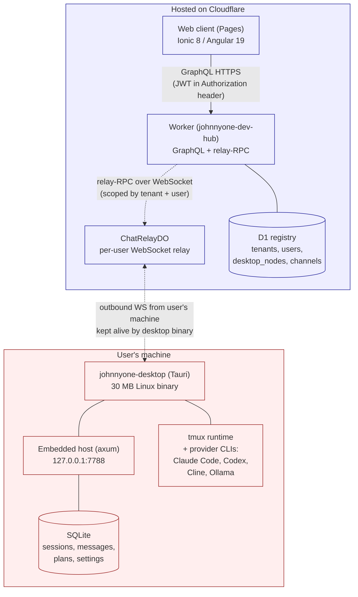

# JohnnyOne

> "Number 5 is alive!" — Short Circuit (1986)

A personal-AI agent platform shaped as a small multi-user SaaS. Each user
installs a single **desktop binary** on their own machine; everyone uses the
same hosted **web client** from anywhere. The desktop binary owns all data
locally — sessions, messages, planner state, agent CLI subprocesses — and the
Cloudflare Worker is a thin relay between the web browser and that binary.

| Surface | URL |
|---|---|
| Web client | https://johnnyone-dev.pages.dev |
| Worker GraphQL | https://johnnyone-dev-hub.ethan-353.workers.dev/graphql |
| Worker relay WebSocket | wss://johnnyone-dev-hub.ethan-353.workers.dev/api/relay/ws |
| Desktop binary (Linux) | `desktop/src-tauri/target/release/johnnyone-desktop` (built locally) |
| Mac binary | not yet — needs a Mac to build |

## Architecture

One Tauri desktop binary per user, one Worker for everyone, one Pages site for everyone:



### The big picture

1. User installs the desktop binary on their machine. The binary registers
   the machine as their `desktop_node` (one row in D1) and keeps an outbound
   WebSocket open to `ChatRelayDO`.
2. User opens the hosted web client in any browser, logs in, gets a JWT.
3. Every action in the web client (open a session, send a message, browse the
   filesystem) is a GraphQL request to the worker. The worker resolves the
   user's online `desktop_node` from D1 and forwards the call via
   relay-RPC over the open WebSocket to that user's binary.
4. The desktop binary handles the call locally (writes to its SQLite, spawns
   provider CLIs in tmux panes, etc.) and streams responses back the same way.

The web client holds **no user data**. Everything lives in the user's local
SQLite. If two users have a binary running, each only ever sees their own
data — the worker scopes every relay-RPC by `WHERE tenant_id = ? AND user_id = ?`.

### Why a single binary

Originally split into two: `johnnyone-host` (headless daemon) + `johnnyone-desktop`
(Tauri shell). Today both are folded into a single `johnnyone-desktop` Tauri
binary that opens a window AND runs the embedded host listener. One binary to
install, one process to supervise. See `personal/docs/johnnyone/decisions/`
for the rationale.

## Project structure

```
johnnyone/
  web/                      Web client — Ionic 8 / Angular 19 (the hosted Pages app)
    src/app/pages/            login, terminal, planning, development, settings, install
    src/app/services/         auth, auth.guard, relay-terminal (WS for terminal stream)
  host-app/                 Tauri-window control panel — login / status / providers
    src/app/                  Embedded inside the desktop binary's webview
  ui/                       Shared Angular component library
    src/components/           chat-window, terminal-screen, message-bubble, ...
    src/services/             JohnnyApiService — single GraphQL client used by web + host-app
  desktop/
    src-tauri/              Rust — single Tauri binary (johnnyone-desktop)
      src/main.rs             Tauri entrypoint: opens window + spawns embedded host
      src/host/               axum-based GraphQL listener on :7788
      src/providers/          CLI runners: claude_code, codex, cline, ollama_cli
      src/terminal.rs         tmux runtime (create/capture/send-keys, screen mirror)
      src/services/           agent_plans, chat_host, providers, sessions, ...
      src/agent/              outbound WS client + RPC dispatch
      src/db/                 SQLite + migrations
    project.json              Nx targets: desktop-dev / desktop-build / tauri-dev / tauri-build
  worker/                   Cloudflare Worker — GraphQL gateway
    resolvers/ai/             AI resolvers (all routed to host via relay-RPC)
    resolvers/channels/       Channel adapters (Telegram/Discord/WhatsApp stubs)
    lib/runtime/              relay-rpc.ts, desktop-rpc.ts, chat-relay-do.ts
    d1/migrations/            D1 registry schema
    schema/                   GraphQL schema (johnnyone-ai.graphql, johnnyone-channels.graphql)
    worker.yaml               name: hub → deployed as johnnyone-dev-hub
  attic/                    Frozen old code (excluded from Nx via .nxignore)
    desktop-thin-client/      Original combined desktop UI — superseded by web + host-app
    mobile-thin-client/       Original mobile Capacitor wrap — deferred
  scripts/dev-tmux.sh       Optional local-dev tmux launcher
  lokal.yaml                Local processes, builds, deploy config
```

## Tech stack

| Layer | Tech |
|---|---|
| Web client | Ionic 8 / Angular 19, standalone components |
| Tauri window UI | Same stack, separate Nx project (`host-app/`) |
| Shared components | `ui/` library — `JohnnyApiService`, terminal-screen, chat-window, etc. |
| Desktop binary | Tauri 2 + Rust (`async-graphql`, `axum`, `rusqlite`, `tokio-tungstenite`) |
| Agent runtime | tmux + provider CLIs (Claude Code, Codex, Cline, Ollama) |
| Worker / gateway | Cloudflare Workers (TS) |
| Edge data | D1 (registry) + Durable Objects (`ChatRelayDO`) |
| GraphQL | Schema-first, `graphql-yoga` on web, custom resolver wiring in the worker |
| Monorepo | Nx 20 |

## Getting started

### Prerequisites

- Node.js 20+
- Rust / Cargo (the Tauri binary compiles native code)
- tmux 3+ (provider CLIs run inside it)
- Display server for the Tauri window (WSLg, X11, or macOS native)
- For Tauri builds on Linux: `libwebkit2gtk-4.1-dev libgtk-3-dev libayatana-appindicator3-dev librsvg2-dev`

### Install

```bash
cd personal/apps/johnnyone
npm install
```

## Running locally

There are two reasonable local-dev setups depending on what you're changing:

### A. Web-only against the deployed worker — fastest

You change web code; everything else (worker, host) is the live deployment.

```bash
npx nx serve web                    # http://localhost:4200
```

Then open `http://localhost:4200` and log in with the seeded admin
(`admin@johnnyone.local` / `johnnyone-dev`, tenant `default`). The web app
detects the hostname is `localhost` and falls back to `http://127.0.0.1:7714`
for the worker — if you don't have a local worker, set the worker URL
explicitly in your browser's localStorage:

```js
localStorage.setItem('johnnyone_worker_url', 'https://johnnyone-dev-hub.ethan-353.workers.dev');
```

For this to work, your **desktop binary must be running on your machine** and
the seeded admin user's `JOHNNYONE_USER_ID` env var must match the JWT subject
(see the [live-test runbook](../../docs/johnnyone/runbooks/live-test.md)).

### B. Full stack local (host + worker simulator + web)

You change worker or host code; everything runs against local processes.

```bash
./scripts/dev-tmux.sh
```

Opens a tmux session with three processes:

| Process | Port | What it is |
|---|---|---|
| desktop | 7788 (embedded), display window | `cargo run --bin johnnyone-desktop` |
| edge    | 7714 | `lokal cf worker sim` (local Cloudflare Worker simulator) |
| web     | 4200 | `nx serve web` |

Or run them by hand in three terminals:

```bash
# 1
npm run start:desktop

# 2
npm run start:worker

# 3
npm run start:web
```

See [the local-dev runbook](../../docs/johnnyone/runbooks/local-dev.md) for full
details, env vars, ports, and troubleshooting.

## Running the JohnnyOne desktop binary

End-users only need to run the desktop binary on their own machine and use the
hosted web client from any browser. No other local setup.

### Build the Linux binary

```bash
cd personal/apps/johnnyone
nx build host-app                 # build the Angular UI the Tauri window loads
cd desktop/src-tauri
cargo build --release --bin johnnyone-desktop
ls -lh target/release/johnnyone-desktop          # ~30 MB
```

### Launch

```bash
JOHNNYONE_WORKER_URL=https://johnnyone-dev-hub.ethan-353.workers.dev \
JOHNNYONE_USER_ID=<your-user-id-uuid> \
JOHNNYONE_TENANT_ID=<your-tenant-id-uuid> \
./desktop/src-tauri/target/release/johnnyone-desktop
```

(Later, once the host-app login flow writes credentials to a config file,
those three env vars stop being needed — see Phase 3 of the
[multi-user-saas plan](../../docs/johnnyone/plans/multi-user-saas/).)

The binary will:

1. Apply DB migrations under `~/.local/share/johnnyone/johnnyone.db`
2. Open a Tauri window pointing at the bundled host-app UI
3. Register your machine with the deployed worker as a `desktop_node`
4. Keep an outbound WebSocket open for relay-RPC
5. Listen on `127.0.0.1:7788` for the embedded UI's local GraphQL calls

See [the install runbook](../../docs/johnnyone/runbooks/installing.md) for the
end-user install flow.

## Live deployments

Only the **worker** and **web client** deploy to Cloudflare. The desktop binary
runs on each user's machine.

```bash
lokal cf deploy --env dev               # worker + Pages, both
lokal cf worker deploy --env dev        # worker only
lokal cf db migrate --env dev           # apply D1 migrations
```

### Account + URLs

- CF account: `elitechance` (configured in `~/.lokal/cf.yaml`)
- Worker name pattern: `johnnyone-<env>-hub` (worker.yaml `name: hub` is the suffix)
  → dev = `johnnyone-dev-hub.ethan-353.workers.dev`
- Pages project: `johnnyone-dev`
  → `https://johnnyone-dev.pages.dev`

### Worker secrets

Only one secret is required:

```bash
echo -n "<rand-base64-48>" | npx wrangler secret put JWT_SECRET --name johnnyone-dev-hub
```

If you rename the worker (change `worker.yaml: name`), CF treats it as a new
script and you'll need to re-set this secret on the new name.

See [the live-test runbook](../../docs/johnnyone/runbooks/live-test.md) for
verification scripts (login, relay-RPC smoke, etc.).

## GraphQL API

The worker exposes ~75 auto-wired resolvers grouped by capability. Every
mutation/query that needs host data is routed via `relayRpc` /
`desktopRpc` to the user's online desktop binary.

- **Auth** (lokal builtin) — `login`, `loginWithOauth`, `myCompleteFirstLogin`, `adminCreate{User,Tenant}`, `refreshToken`
- **Sessions** — `listAiSessions`, `getAiSession`, `createAiSession`, `updateAiSession{Title,Provider,WorkingDirectory,Archived}`, `deleteAiSession`
- **Chat** — `sendRelayChatMessage`, `cancelAiGeneration`, `listAiMessages`
- **Agent planner** — `listAgentPlans`, `getAgentPlan`, `createAgentPlan`, `startAgentPlan`, `updateAgentPlan{Stopped,Blocked}`, `updateAgentPhaseManualPass`, `retryAgentReviewer`, `sendAgentFeedbackToWorker`, `deleteAgentPlan`
- **Workspace / host files** — `browseHostDirectory`, `listWorkspaceFiles`, `readHostFile`, `getWorkspaceFileDiff`, `validateWorkspacePlan`
- **Providers / settings** — `listDetectedCliTools`, `listProviderConfigs`, `upsertProviderConfig`, `deleteProviderConfig`, `getSetting`, `setSetting`, `getPlannerPromptSettings`, `updatePlannerPromptSettings`
- **Nodes** — `listDesktopNodes`, `registerDesktopNode`, `updateDesktopNodeStatus`
- **Channels / attachments** — `listChannelBindings`, `link/unlinkChannel`, `createChannelWebhook`, `get/create/deleteChatAttachment`
- **Subscriptions** — `onRelayChatDelta`, `onRelayChatMessage`, `onDesktopNodeStatus`

Schema files:
- [`worker/schema/johnnyone-ai.graphql`](worker/schema/johnnyone-ai.graphql)
- [`worker/schema/johnnyone-channels.graphql`](worker/schema/johnnyone-channels.graphql)

## Documentation map

| Doc | What it covers |
|---|---|
| [README.md](README.md) | This file — overview, structure, run + deploy commands |
| [docs/.../runbooks/local-dev.md](../../docs/johnnyone/runbooks/local-dev.md) | Local development workflow |
| [docs/.../runbooks/installing.md](../../docs/johnnyone/runbooks/installing.md) | End-user install of the desktop binary |
| [docs/.../runbooks/live-test.md](../../docs/johnnyone/runbooks/live-test.md) | Smoke-test the deployed worker + Pages |
| [docs/.../decisions/](../../docs/johnnyone/decisions/) | ADRs for the multi-user-saas pivot |
| [docs/.../plans/multi-user-saas/](../../docs/johnnyone/plans/multi-user-saas/) | The active multi-phase plan |

## Roadmap

Phase status lives in
[`personal/docs/johnnyone/plans/multi-user-saas/status.md`](../../docs/johnnyone/plans/multi-user-saas/status.md).

| Area | Status |
|---|---|
| Multi-user SaaS — foundation cleanup (Phase 0) | Done |
| Multi-user SaaS — `web/` scaffold + nav (Phase 1) | Done |
| Multi-user SaaS — pairing + relay-RPC end-to-end (Phase 2) | Done |
| Multi-user SaaS — Tauri control panel (Phase 3) | Done — host folded into one binary |
| Multi-user SaaS — Mac binary + R2 hosting (Phase 4) | Pending (needs Mac) |
| Multi-user SaaS — ADRs (Phase 5) | Done |
| Terminal page restored from attic + workspace browser | Done (2026-05-23) |
| Planner / Development modes restored from attic | Done (2026-05-23) |
| Channel adapters (Telegram, Discord, WhatsApp) | In progress (resolvers stubbed) |
| Browser automation, cron scheduling, voice input | Planned |

## License

Private / Proprietary. All rights reserved.
