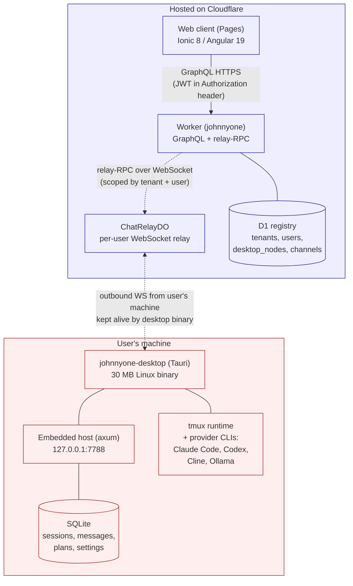

# JohnnyOne

> "Number 5 is alive!" — Short Circuit (1986)

A personal-AI agent platform shaped as a small multi-user SaaS. Each user
installs a single **desktop binary** on their own machine; everyone uses the
same hosted **web client** from anywhere. The desktop binary owns all data
locally — sessions, messages, planner state, agent CLI subprocesses — and the
Cloudflare Worker is a thin relay between the web browser and that binary.

| Surface | URL |
|---|---|
| Web client | https://johnnyone.pages.dev |
| Worker GraphQL | https://johnnyone.ethan-353.workers.dev/graphql |
| Worker relay WebSocket | wss://johnnyone.ethan-353.workers.dev/api/relay/ws |
| Desktop binary (Linux) | `desktop/src-tauri/target/release/johnnyone-desktop` (built locally) |
| Mac binary | not yet — needs a Mac to build |

## Architecture

One Tauri desktop binary per user, one Worker for everyone, one Pages site for everyone:



### The big picture

1. User installs the desktop binary on their machine. The binary registers
   the machine as their `desktop_node` (one row in D1) and keeps an outbound
   WebSocket open to `ChatRelayDO`.
2. User opens the hosted web client in any browser, logs in, gets a JWT.
3. Every action in the web client (open a session, send a message, browse the
   filesystem) is a GraphQL request to the worker. The worker resolves the
   user's online `desktop_node` from D1 and forwards the call via
   relay-RPC over the open WebSocket to that user's binary.
4. The desktop binary handles the call locally (writes to its SQLite, spawns
   provider CLIs in tmux panes, etc.) and streams responses back the same way.

The web client holds **no user data**. Everything lives in the user's local
SQLite. If two users have a binary running, each only ever sees their own
data — the worker scopes every relay-RPC by `WHERE tenant_id = ? AND user_id = ?`.

### Why a single binary

Originally split into two: `johnnyone-host` (headless daemon) + `johnnyone-desktop`
(Tauri shell). Today both are folded into a single `johnnyone-desktop` Tauri
binary that opens a window AND runs the embedded host listener. One binary to
install, one process to supervise. See `personal/docs/johnnyone/decisions/`
for the rationale.

## Project structure

```
johnnyone/
  web/                      Web client — Ionic 8 / Angular 19 (the hosted Pages app)
    src/app/pages/            login, terminal, planning, development, settings, install
    src/app/services/         auth, auth.guard, relay-terminal (WS for terminal stream)
  host-app/                 Tauri-window control panel — login / status / providers
    src/app/                  Embedded inside the desktop binary's webview
  ui/                       Shared Angular component library
    src/components/           chat-window, terminal-screen, message-bubble, ...
    src/services/             JohnnyApiService — single GraphQL client used by web + host-app
  desktop/
    src-tauri/              Rust — single Tauri binary (johnnyone-desktop)
      src/main.rs             Tauri entrypoint: opens window + spawns embedded host
      src/host/               axum-based GraphQL listener on :7788
      src/providers/          CLI runners: claude_code, codex, cline, ollama_cli
      src/terminal.rs         tmux runtime (create/capture/send-keys, screen mirror)
      src/services/           agent_plans, chat_host, providers, sessions, ...
      src/agent/              outbound WS client + RPC dispatch
      src/db/                 SQLite + migrations
    project.json              Nx targets: desktop-dev / desktop-build / tauri-dev / tauri-build
  worker/                   Cloudflare Worker — GraphQL gateway
    resolvers/ai/             AI resolvers (all routed to host via relay-RPC)
    resolvers/channels/       Channel adapters (Telegram/Discord/WhatsApp stubs)
    lib/runtime/              relay-rpc.ts, desktop-rpc.ts, chat-relay-do.ts
    d1/migrations/            D1 registry schema
    schema/                   GraphQL schema (johnnyone-ai.graphql, johnnyone-channels.graphql)
    worker.yaml               legacy `name: hub` (ignored for deploy naming)
  attic/                    Frozen old code (excluded from Nx via .nxignore)
    desktop-thin-client/      Original combined desktop UI — superseded by web + host-app
    mobile-thin-client/       Original mobile Capacitor wrap — deferred
  scripts/dev-tmux.sh       Optional local-dev tmux launcher
  lokal.yaml                Local processes, builds, deploy config
```

## Planner and Development Notes

> **Coordinator internals** — the T1/T2 handoff, the `reportAgentResult` API (the
> sole completion/verdict signal; terminal scraping was removed), the
> nudge/escalate + clarify reliability mechanisms, and why scraping was dropped
> (Grok alt-screen scroll-off) live in
> **[`docs/coordinator.md`](docs/coordinator.md)**.

Recent planner/runtime behavior worth knowing:

- Planning and Development tabs use a soft-close model. Closing a run removes it from the active tab strip but keeps the plan row, sessions, and plan path so it can be re-opened from `Existing Plans` if the plan path still exists.
- Planning and Development run titles are renameable from the coordinator UI and the title is persisted in the local SQLite `agent_plans` row, so reopened runs keep the renamed title.
- Development can start from a selected phase in either `continue` mode or `single` mode. `single` runs stop after the selected phase is approved instead of automatically continuing to later phases.
- The shared terminal widget lives in `ui/src/components/terminal-screen/` and is used by the standalone Terminal page plus Planning/Development T1/T2. Terminal affordances such as upload image, mobile input helpers, mermaid detection, and history loading should be implemented there, not forked per page.
- The planner event log is enriched by the desktop backend. Events now carry actor/category/summary/status transitions plus derived review reasons. For T2 `NEEDS_CHANGES` or `BLOCKED`, the backend parses `SUMMARY`, `FINDINGS`, and `NEXT_STEPS` from the reviewer footer and promotes the first concrete finding into the event `reason`.
- T2 send-back events are intended to explain the pushback, not only the transport action. If the event log only says something like `sent back` without a concrete reason, that is considered drift from current behavior.

## Tech stack

| Layer | Tech |
|---|---|
| Web client | Ionic 8 / Angular 19, standalone components |
| Tauri window UI | Same stack, separate Nx project (`host-app/`) |
| Shared components | `ui/` library — `JohnnyApiService`, terminal-screen, chat-window, etc. |
| Desktop binary | Tauri 2 + Rust (`async-graphql`, `axum`, `rusqlite`, `tokio-tungstenite`) |
| Agent runtime | tmux + provider CLIs (Claude Code, Codex, Cline, Ollama) |
| Worker / gateway | Cloudflare Workers (TS) |
| Edge data | D1 (registry) + Durable Objects (`ChatRelayDO`) |
| GraphQL | Schema-first, `graphql-yoga` on web, custom resolver wiring in the worker |
| Monorepo | Nx 20 |

## Getting started

### Prerequisites

- Node.js 20+
- Rust / Cargo (the Tauri binary compiles native code)
- tmux 3+ (provider CLIs run inside it)
- Display server for the Tauri window (WSLg, X11, or macOS native)
- For Tauri builds on Linux: `libwebkit2gtk-4.1-dev libgtk-3-dev libayatana-appindicator3-dev librsvg2-dev`

### Install

```bash
cd personal/apps/johnnyone
npm install
```

## Running locally

There are two reasonable local-dev setups depending on what you're changing:

### A. Web-only against the deployed worker — fastest

You change web code; everything else (worker, host) is the live deployment.

```bash
npx nx serve web                    # http://localhost:4200
```

Then open `http://localhost:4200` and log in with the seeded admin
(`admin@johnnyone.local` / `johnnyone-dev`, tenant `default`). The web app
detects the hostname is `localhost` and falls back to `http://127.0.0.1:7714`
for the worker — if you don't have a local worker, set the worker URL
explicitly in your browser's localStorage:

```js
localStorage.setItem('johnnyone_worker_url', 'https://johnnyone.ethan-353.workers.dev');
```

For this to work, your **desktop binary must be running on your machine** and
the seeded admin user's `JOHNNYONE_USER_ID` env var must match the JWT subject.

### B. Full stack local (host + worker simulator + web)

You change worker or host code; everything runs against local processes.

```bash
./scripts/dev-tmux.sh
```

Opens a tmux session with three processes:

| Process | Port | What it is |
|---|---|---|
| desktop | 7788 (embedded), display window | `cargo run --bin johnnyone-desktop` |
| edge    | 7714 | `lokal cf worker sim` (local Cloudflare Worker simulator) |
| web     | 4200 | `nx serve web` |

Or run them by hand in three terminals:

```bash
# 1
npm run start:desktop

# 2
npm run start:worker

# 3
npm run start:web
```

## Running the JohnnyOne desktop binary

End-users only need to run the desktop binary on their own machine and use the
hosted web client from any browser. No other local setup.

### Build the Linux binary

Two modes — pick one. **Do not mix them up.**

#### Mode A — production single-binary (the way users run it)

```bash
cd personal/apps/johnnyone/desktop/src-tauri
npx tauri build --no-bundle        # uses the repo's @tauri-apps/cli devDep — no `cargo install` needed
# (equivalently `cargo tauri build --no-bundle` IF you've run `cargo install tauri-cli`)
ls -lh target/release/johnnyone-desktop          # ~30 MB, self-contained
```

> `npx tauri build --no-bundle` and `cargo tauri build --no-bundle` are
> equivalent — both run the Tauri build pipeline (beforeBuildCommand → embed
> assets → production-webview Rust build). Prefer `npx` since `@tauri-apps/cli`
> is already a devDependency; `cargo tauri` additionally requires the
> `cargo-tauri` subcommand (`cargo install tauri-cli`). `npm run build:desktop`
> (runs `scripts/build-desktop.sh`) is also correct — wipes `dist/host-app`,
> rebuilds host-app, then `cargo build --release --features tauri/custom-protocol`.
> See `docs/operations.md`.

This is the only command that produces a runnable single binary. It:

1. Runs the configured `beforeBuildCommand` (`npx nx build host-app`) so `dist/host-app/browser/` is fresh.
2. Embeds those assets into the Rust binary via Tauri's codegen.
3. Builds the `tauri` crate **with the production webview-runtime flag** so the webview loads the embedded assets instead of `devUrl`.

After this, just exec the binary directly — see **Launch** below.

#### Mode B — dev with HMR (only when iterating on the host-app UI)

```bash
cd personal/apps/johnnyone/desktop/src-tauri
cargo tauri dev    # spawns `npx nx serve host-app --port 4201` + cargo run in debug
```

The webview loads from `http://localhost:4201` (per `tauri.conf.json` `devUrl`) so
Angular HMR works. Requires the dev server alongside the binary.

> **Gotcha — blank window / "Could not connect to localhost".** Plain
> `cargo build --release --bin johnnyone-desktop` (without
> `--features tauri/custom-protocol`) compiles and `:7788` binds, but the Tauri
> webview stays in dev mode and tries `http://localhost:4201`. Fix: `npx tauri
> build --no-bundle`, `npm run build:desktop`, or `cargo build --release --bin
> johnnyone-desktop --features tauri/custom-protocol` after `nx build host-app`.
> Details: `docs/operations.md`.

### Launch

```bash
JOHNNYONE_WORKER_URL=https://johnnyone.ethan-353.workers.dev \
JOHNNYONE_USER_ID=<your-user-id-uuid> \
JOHNNYONE_TENANT_ID=<your-tenant-id-uuid> \
./desktop/src-tauri/target/release/johnnyone-desktop
```

(Later, once the host-app login flow writes credentials to a config file,
those three env vars stop being needed.)

The binary will:

1. Apply DB migrations under `~/.local/share/johnnyone/johnnyone.db`
2. Open a Tauri window pointing at the bundled host-app UI
3. Register your machine with the deployed worker as a `desktop_node`
4. Keep an outbound WebSocket open for relay-RPC
5. Listen on `127.0.0.1:7788` for the embedded UI's local GraphQL calls

## Operational notes (hard-won)

Build/run/debug/deploy gotchas a fresh agent needs (toolchain, the
directory-move build-cache trap, local-dev launch identity, the terminal attach
path, and the real deploy story) live in **[`docs/operations.md`](docs/operations.md)**.

## Live deployments

Only the **worker** and **web client** deploy to Cloudflare. The desktop binary
runs on each user's machine.

```bash
lokal cf deploy --env prod              # worker + Pages, both
npm run deploy:worker                   # worker only (johnnyone)
lokal cf db migrate --env prod          # apply D1 migrations
```

### Account + URLs

- CF account: `elitechance` (configured in `~/.lokal/cf.yaml`)
- Worker deploy name: `johnnyone` (`lokal cf worker deploy --env prod`; dev/qa use
  `johnnyone-dev` / `johnnyone-qa`)
  → `https://johnnyone.ethan-353.workers.dev`
- Pages project: `johnnyone` → `https://johnnyone.pages.dev` (slug from
  `lokal.yaml`; deploy with `lokal cf pages deploy --env prod`)

### Worker secrets

Only one secret is required: `JWT_SECRET` on the prod worker script `johnnyone`.

```bash
lokal cf worker secrets set --env prod --name JWT_SECRET --value '<secret>'
lokal cf worker secrets list --env prod
```

**Gotcha:** deploying to a *new* worker name succeeds even when `JWT_SECRET` is
missing; the worker then returns `error code: 1101` until the secret is set.
Secrets cannot be read back from Cloudflare — when renaming from a legacy script
(e.g. `johnnyone-hub`), you must re-set the **same** value manually. See
[`docs/operations.md`](docs/operations.md) § Deploy gotchas.

### Deploy gotchas

Full list (JWT_SECRET trap, D1 migration idempotency, `nx` on PATH, lokal naming,
`ethan-353` workers.dev subdomain): **[`docs/operations.md`](docs/operations.md)**
§ Deploying.

- **Nx caches builds aggressively.** If you've changed `web/` or `ui/` code
  but `npx nx build web` reports "Nx read the output from the cache instead
  of running the command," force a real rebuild:

  ```bash
  rm -rf .nx/cache dist/web dist/ui
  npx nx build web --skip-nx-cache
  ```

  Always do this before `lokal cf pages deploy --env prod` if you've changed
  components — otherwise the deploy uploads a stale bundle.

- **Lokal's resolver-schema validator infers Query vs Mutation from the
  filename prefix.** Recognized mutation prefixes:

  ```
  create-, update-, upsert-, delete-, remove-,
  assign-, complete-, admin-, refresh-,
  start-, send-, close-, revoke-, report-,
  publish-, make-, request-, share-,
  change-, link-, unlink-, register-, authenticate-, mark-
  ```

  Anything else defaults to Query. If your mutation resolver isn't
  recognized (validator complains `Missing resolver: Mutation.fooBar
  (expected: resolvers/foo-bar.ts)`), rename the file to use a recognized
  prefix and align the GraphQL field. You can keep a friendly public name
  in `JohnnyApiService` by wrapping it.

- **`cargo build` is not the way to build the production binary.** The desktop
  binary embeds `dist/host-app/browser` at compile time *and* needs the Tauri
  runtime built in production-webview mode. `cargo build --release` does
  neither for you. Use `cargo tauri build --no-bundle` — see "Running the
  JohnnyOne desktop binary → Build the Linux binary" above.

## GraphQL API

The worker exposes ~75 auto-wired resolvers grouped by capability. Every
mutation/query that needs host data is routed via `relayRpc` /
`desktopRpc` to the user's online desktop binary.

- **Auth** (lokal builtin) — `login`, `loginWithOauth`, `myCompleteFirstLogin`, `adminCreate{User,Tenant}`, `refreshToken`
- **Sessions** — `listAiSessions`, `getAiSession`, `createAiSession`, `updateAiSession{Title,Provider,WorkingDirectory,Archived}`, `deleteAiSession`
- **Chat** — `sendRelayChatMessage`, `cancelAiGeneration`, `listAiMessages`
- **Agent planner** — `listAgentPlans`, `getAgentPlan`, `createAgentPlan`, `startAgentPlan`, `updateAgentPlanAmend`, `updateAgentPlan{Stopped,Blocked}`, `updateAgentPhaseManualPass`, `retryAgentReviewer`, `sendAgentFeedbackToWorker`, `deleteAgentPlan`
- **Workspace / host files** — `browseHostDirectory`, `listWorkspaceFiles`, `readHostFile`, `getWorkspaceFileDiff`, `validateWorkspacePlan`
- **Providers / settings** — `listDetectedCliTools`, `listProviderConfigs`, `upsertProviderConfig`, `deleteProviderConfig`, `getSetting`, `setSetting`, `getPlannerPromptSettings`, `updatePlannerPromptSettings`
- **Nodes** — `listDesktopNodes`, `registerDesktopNode`, `updateDesktopNodeStatus`
- **Channels / attachments** — `listChannelBindings`, `link/unlinkChannel`, `createChannelWebhook`, `get/create/deleteChatAttachment`
- **Subscriptions** — `onRelayChatDelta`, `onRelayChatMessage`, `onDesktopNodeStatus`

Schema files:
- [`worker/schema/johnnyone-ai.graphql`](worker/schema/johnnyone-ai.graphql)
- [`worker/schema/johnnyone-channels.graphql`](worker/schema/johnnyone-channels.graphql)

## Documentation

Repo-local docs live alongside the code:

- **`README.md`** (this file) — overview, structure, run + deploy commands,
  feature inventory, deploy gotchas
- **`CHANGELOG.md`** — dated log of what shipped, in Keep-a-Changelog format

## Notable features shipped beyond the multi-user-saas plan

The bullets below track work that happened on top of the multi-user-saas
plan, so a fresh session can know what's already live.

- **Per-plan git history (2026-05-25)** — every approved plan state lands as
  a commit in `plan_path/.git`. Initial + amend + revalidate + phase-pass
  commits. Helpers in `desktop/src-tauri/src/services/git_history.rs`.
- **Plan amendments (2026-05-25)** — `updateAgentPlanAmend(id, brief)`
  mutation re-runs T1 in edit-mode + T2 on the diff. UI: "Amend" button in
  the planner coordinator panel. Storage: `agent_plans.amend_brief` column
  (migration 007).
- **Session kinds (2026-05-25)** — `sessions.kind = 'user' | 'agent'`
  (migration 008). `/terminal` only shows user-created sessions; planner
  T1/T2 sessions are hidden. `list_sessions` defaults to `kind='user'`.
- **Convention paths in planner prompts (2026-05-25)** — `{{conventions_path}}`
  pointing at `{workspace}/common/conventions/` is injected into all four
  default planner prompt templates. T1/T2 read every file under that path
  before producing or validating a plan.
- **Markdown link interceptor in planner (2026-05-25)** — clicks on relative
  links inside a rendered plan markdown (e.g. `../../common/methodology.md`)
  are intercepted via a `document:click` HostListener, resolved against the
  current plan file's directory, and opened in the same preview pane.
- **Mermaid zoom modal (2026-05-25)** — global `<app-mermaid-zoom-modal>`
  reachable via `MermaidZoomService`. Click any rendered mermaid diagram
  (planner preview or chat message) to open full-screen. Pinch + drag +
  wheel + double-tap-reset.
- **All four planner modals are Ionic-native (2026-05-25)** — Files, Setup
  (New Planner), Browser (directory picker), Phase Tasks. Use
  `<ion-modal>` + `<ion-segment>` + `<ion-list>` + `<ion-input>` /
  `<ion-textarea>` per `common/conventions/ui.md`. The legacy
  `.modal-backdrop` + `.setup-modal` markup is gone.
- **Mobile-friendly navigation (2026-05-25)** — `<ion-split-pane>` left
  menu collapses to a swipe drawer below 768px. Hamburger menu button +
  page title chip (TERMINAL / PLANNING / DEVELOPMENT) in each page's
  topbar. Tab-switch state reset so terminal screens + file lists clear
  cleanly between plans.
- **Tab autocomplete in shell sessions (2026-05-23)** — xterm `onData`
  wired so Tab, arrow keys, Ctrl-R etc. all reach the shell. Mobile
  textarea Tab is intercepted and flushed to the shell as `\t`.

## Roadmap

| Area | Status |
|---|---|
| Multi-user SaaS — foundation cleanup (Phase 0) | Done |
| Multi-user SaaS — `web/` scaffold + nav (Phase 1) | Done |
| Multi-user SaaS — pairing + relay-RPC end-to-end (Phase 2) | Done |
| Multi-user SaaS — Tauri control panel (Phase 3) | Done — host folded into one binary |
| Multi-user SaaS — Mac binary + R2 hosting (Phase 4) | Pending (needs Mac) |
| Multi-user SaaS — ADRs (Phase 5) | Done |
| Terminal page restored from attic + workspace browser | Done (2026-05-23) |
| Planner / Development modes restored from attic | Done (2026-05-23) |
| Per-plan git history + amend workflow | Done (2026-05-25) |
| Ionic-native modals + mobile responsive nav + mermaid zoom | Done (2026-05-25) |
| Channel adapters (Telegram, Discord, WhatsApp) | In progress (resolvers stubbed) |
| Browser automation, cron scheduling, voice input | Planned |

## License

Private / Proprietary. All rights reserved.
