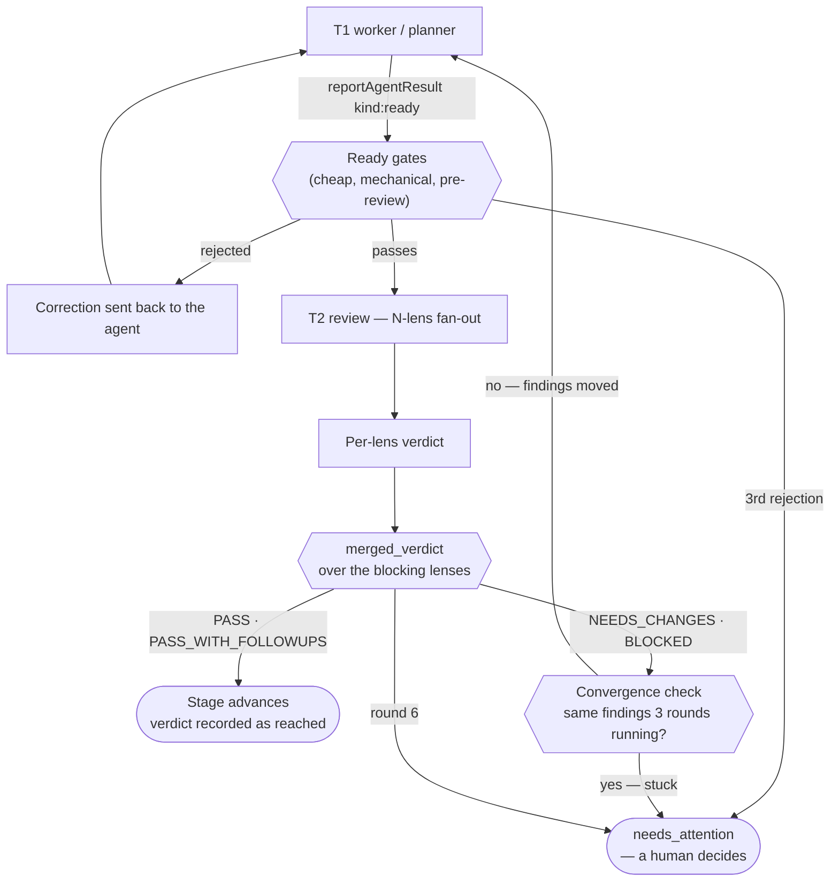
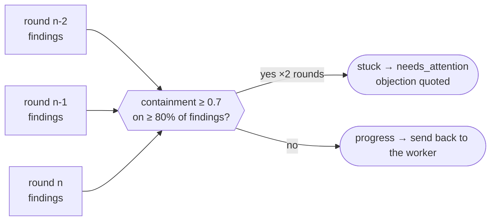

# SDLC gates — verdicts, ready gates, and the loop guards

How the coordinator decides that a stage is actually finished, and what it does when the
agent says so but the evidence disagrees.

Every gate here exists because of a specific failure observed on a real run. The
catalogue those failures came from is [`j1-improvements-2026-08-18.md`](j1-improvements-2026-08-18.md);
the redesign they fed is [`sdlc-process-proposal.html`](sdlc-process-proposal.html). The
coordinator's transport and T1/T2 handoff are in [`coordinator.md`](coordinator.md) — this
document is only about the gates layered on top.

The problem in one line: **every place the coordinator trusted an agent's self-report about
its own work eventually produced a false pass.**

---

## Where the gates sit

Two independent budgets protect the loop: the **ready gates** bounce at most 3 times per
stage attempt, and the **review rounds** stop at 6 — or sooner, if the findings stop moving.

---

## 1 · Verdicts

`PASS` · `PASS_WITH_FOLLOWUPS` · `NEEDS_CHANGES` · `BLOCKED`

`PASS_WITH_FOLLOWUPS` exists because the only way for a lens to record *anything* used to be
`NEEDS_CHANGES`. A naming nit and a missing acceptance criterion both cost a full round, and
real defects ended up buried among refinements. A lens now uses it when the work is correct
and shippable but it wants to record non-blocking observations.

- `verdict_advances()` — the single answer to "does this let the stage move on?" `PASS` and
  `PASS_WITH_FOLLOWUPS` do; the other two do not.
- `merged_verdict()` — rolls the lens verdicts up. Any `BLOCKED` wins, then any
  `NEEDS_CHANGES`; if any lens used follow-ups and none objected, the roll-up is
  `PASS_WITH_FOLLOWUPS`, **not** `PASS`. The follow-ups travel with the work.
- `gate_verdict_over_blocking()` filters to `blocking: true` lenses first, then defers to
  `merged_verdict` — it is a filter on the input, not a second gate.

**The recorded verdict is the verdict that was reached.** Both pass paths used to write the
literal `"PASS"`, so a stage that passed with follow-ups was recorded as a clean pass and the
follow-ups were lost at the one step meant to carry them. The routing was correct throughout,
which is why it went unnoticed: only the record was wrong. Anything reading history —
the timeline, the convergence check, a human asking why a plan was approved — saw a pass that
no lens gave.

---

## 2 · Ready gates

Cheap mechanical checks that run **before** a review round is spent. Each returns
`Option<String>` — `None` to proceed, or the correction to send back.

| Gate | Stage | Rejects a `ready` when |
|---|---|---|
| `planning_deliverable_missing` | planning | the store has no `overview.md` or an empty `phases/` |
| `acceptance_not_executable` | planning | a phase states no acceptance criteria, or states one that does not name what decides it |
| `failing_test_command` | phase | the plan's declared `test_commands` do not pass, run by the coordinator itself |
| `spec_weakened_reason` | phase | spec lines were removed from the plan store during development |
| `evidence_provenance_reason` | phase | screenshots are byte-identical to each other, or nothing describes them |
| `unfinished_tasks_reason` | phase | task `status.yml` files are not `done` |

### Executable acceptance

"Give every phase EXPLICIT, TESTABLE acceptance criteria" sat in the planner prompt for
months, and plans still came back with criteria like *the layout works on mobile*. Nothing
downstream can act on that: the worker cannot tell when it is done, and the reviewer can do
no better than agree with it. Testability had to become something the coordinator decides.

Each criterion must name what decides it, in backticks — a command, a route and element, a
`file:line`. Placement-agnostic (task prompt, phase overview, wherever the plan puts it), and
a later heading closes the section so ordinary bullets are not judged as criteria.

> *the aux layer traps focus* → **`npm run e2e -- aux-focus` passes**, or
> *on `/patients/:id` with the aux layer open, Tab from the last control reaches `.aux-skip-link`*

### Spec weakening

The plan store is committed when T2 approves the plan, so during development its `HEAD` **is**
the agreed contract, and T2 reviews the phase against it. A worker that edits those files
moves the goalposts to wherever the work landed — the review still passes, but it is no
longer checking what was agreed. The most expensive kind of false pass, because nothing
downstream looks wrong.

Only *removed* lines count. Adding detail to a spec is normal; deleting or rewording a
requirement is the move worth catching, and a reworded line shows up as a removal. The
worker's own `status.*` and `decisions.md` are excluded — writing those is the job.

### Evidence provenance

A screenshot is the one claim a reviewer cannot re-derive: a failing test can be re-run, but
a picture is taken on trust. Two failures showed up in practice — the same screen submitted
twice under different names, and a file dropped into `artifacts/` with nothing saying what it
shows.

Scope is what the worker *added*: untracked files under the phase, since the store is
committed at approval, so mocks that shipped with the spec are left alone. Duplicates are
found by comparing bytes, not a digest — no hashing dependency and no chance of collision.

---

## 3 · Loop guards

### Findings-diff convergence

The round counter alone cannot tell a loop that is converging slowly from one that is not
converging at all: six rounds of genuine progress and six rounds of a reviewer restating one
objection both hit the cap the same way.

Findings are compared across rounds. Three rounds raising substantially the same objection
means the loop is stuck, and it reaches a human in three rounds instead of burning the full
budget — with the objection named, rather than only a round count.

Comparison is by **containment** (shared words over the smaller finding), not Jaccard: a
reviewer who restates the same objection with more detail has not raised a different one, but
Jaccard reads every added word as divergence and would score a faithful restatement as
progress.

### Ready-bounce cap

Every ready-gate rejection sends a correction and loops, and nothing bounded that loop. An
agent that cannot satisfy a gate — or does not understand the correction — would be told the
same thing forever; unattended, that is a run that burns tokens and arrives nowhere.

`bounce_ready_or_escalate()` counts rejections back to the stage's own start, so a restarted
stage and each phase get a fresh budget, and parks the run on the third with the last
correction quoted.

### Task reconciliation

A phase reported ready while its task `status.yml` files still said `todo`. The coordinator
reads those files to know what remains, so stale ones make its own view of the run wrong.
Opt-in by construction: a plan whose tasks declare no status is not judged.

---

## Observed behaviour — first run through the full set

`ea554e33`, Caseroom QA shell fixes, 21 Aug 2026. Planning approved in 3 review rounds:

- `acceptance_not_executable` **rejected the first two `ready` reports** — the planner had
  written checklist-style criteria that named no check. It corrected them and passed. (Budget
  is 3; it used 2.)
- **7 of 9 lens verdicts were `PASS_WITH_FOLLOWUPS`.** Without the verdict, each would have
  been either a false clean pass or a full extra round for a non-blocking note.
- The convergence check did **not** fire — each round raised different findings, which is
  what converging looks like.
- The recording bug above was caught by reading this timeline: three follow-up verdicts, one
  clean `PASS` in the record.

Development, same initiative, run `2af99c0a` — **`spec_weakened_reason` fired three times**:

| When | Phase | What the worker removed |
|---|---|---|
| 08:34 | `01-composer-rows` | rows from the phase's screens-to-verify table |
| 09:14 | `01-composer-rows` | CSS from the D2 mock artifact the phase is measured against |
| 15:04 | `02-drag-reveal` | acceptance criteria, incl. the one requiring `onMove` on **both** gestures |

This is the gate's whole case, observed rather than argued. Each of those edits would have left a
review that still passed, against goalposts the worker had moved — and nothing downstream would
have looked wrong. The third is the sharpest: the removed line was the criterion requiring the
drag to follow the pointer on *both* gestures, deleted while that phase was failing review for
exactly that behaviour.

The bounce budget also showed why it is per-stage rather than per-run: phase 01 spent two of its
three, and phase 02 started fresh at 1/3 rather than inheriting a nearly-exhausted budget from a
phase that had already been fixed.

---

## Where the code is

All of it in `desktop/src-tauri/src/services/agent_plans.rs`:

| Concern | Functions |
|---|---|
| Verdicts | `verdict_advances`, `merged_verdict`, `normalize_verdict_token`, `gate_verdict_over_blocking` |
| Ready gates | `planning_deliverable_missing`, `acceptance_not_executable`, `failing_test_command`, `spec_weakened_reason`, `evidence_provenance_reason`, `unfinished_tasks_reason` |
| Loop guards | `stalled_findings_reason`, `tail_non_pass_findings`, `ready_bounces`, `bounce_ready_or_escalate`, `count_consecutive_non_pass` |

The prompts that tell agents these rules up front live in `planner_prompts.rs` — a gate the
agent only meets as a bounce is a gate that costs a round.
